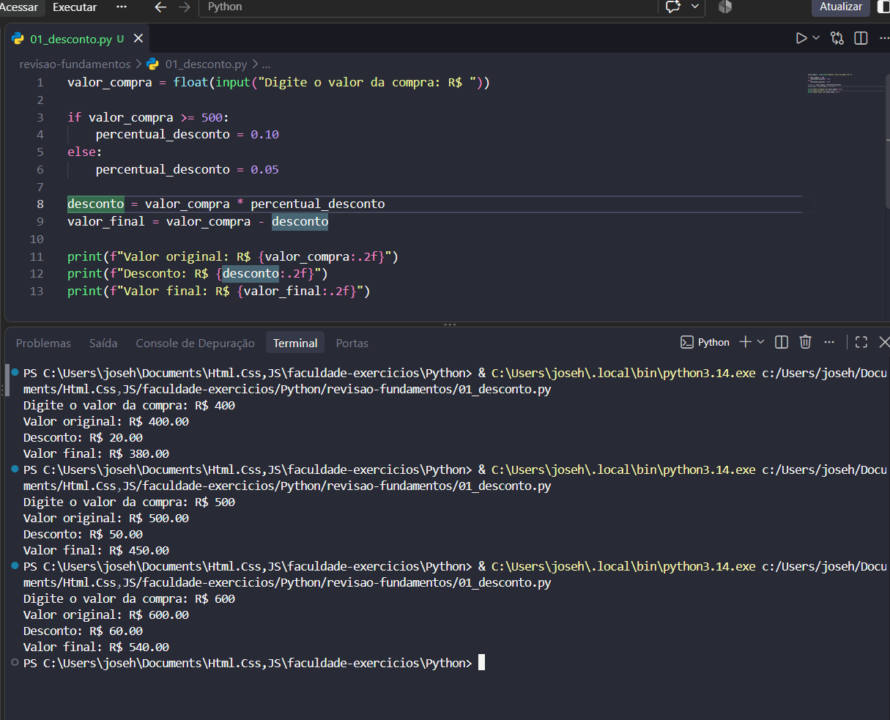
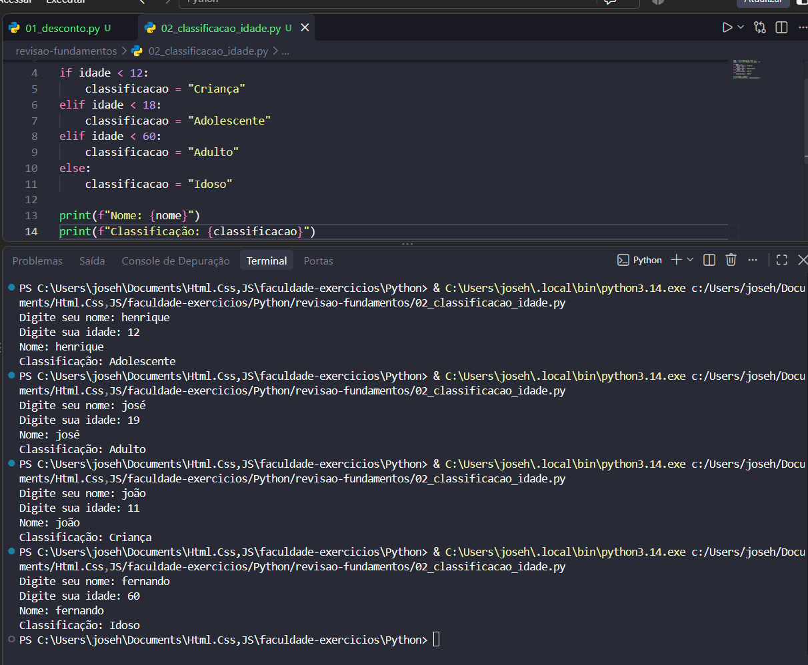
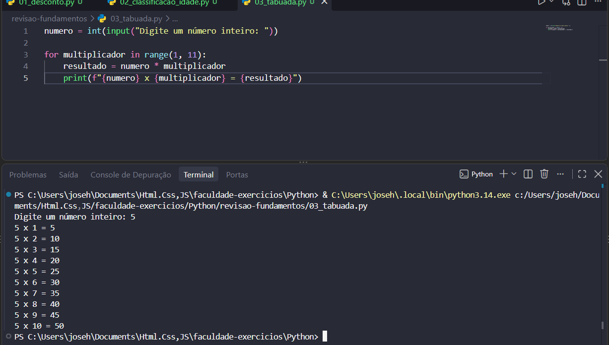
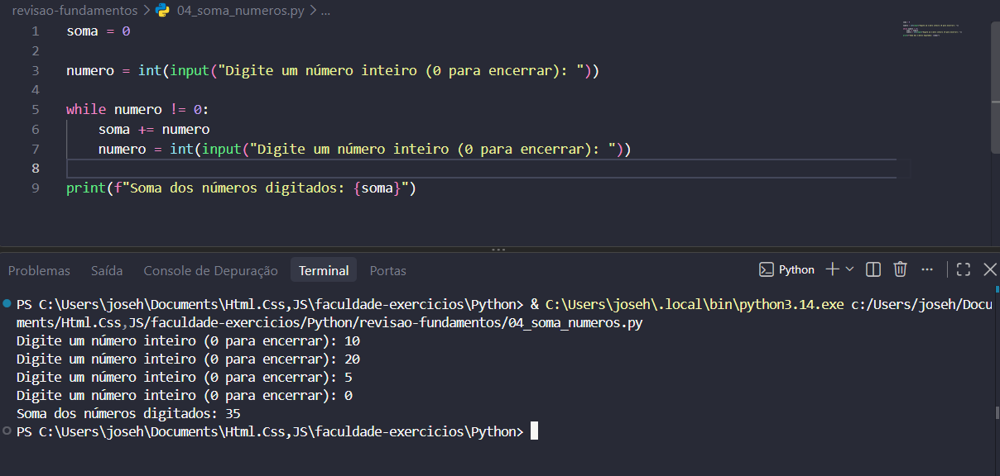

# 🐍 Revisão de Fundamentos — Python

Exercícios desenvolvidos na disciplina de **Paradigmas de Linguagens de Programação**, no curso de **Análise e Desenvolvimento de Sistemas (ADS)**.

Esta atividade reúne quatro programas referentes às questões **16 a 19** da lista de revisão, numerados aqui de **01 a 04**.

## 🎯 Objetivo

Praticar entrada e saída de dados, cálculos, estruturas condicionais e estruturas de repetição em Python.

## 🛠️ Tecnologias utilizadas

- Python 3
- Visual Studio Code
- Git e GitHub

## 📁 Arquivos

| Arquivo | Atividade | Questão da lista |
|---|---|---|
| [01_desconto.py](01_desconto.py) | Cálculo de desconto | 16 |
| [02_classificacao_idade.py](02_classificacao_idade.py) | Classificação de idade | 17 |
| [03_tabuada.py](03_tabuada.py) | Tabuada com `for` | 18 |
| [04_soma_numeros.py](04_soma_numeros.py) | Soma com `while` | 19 |

---

## 💰 01 — Cálculo de desconto

### Enunciado

Solicitar o valor de uma compra. Aplicar **10% de desconto** para valores maiores ou iguais a R$ 500,00 e **5%** para valores abaixo disso. Exibir o valor original, o desconto e o valor final com duas casas decimais.

### Lógica utilizada

O valor é recebido com `input()` e convertido para `float()`. A estrutura `if/else` escolhe o percentual de desconto.

```python
if valor_compra >= 500:
    percentual_desconto = 0.10
else:
    percentual_desconto = 0.05
```

O desconto é calculado multiplicando o valor da compra pelo percentual. Em seguida, ele é subtraído do valor original. A formatação `:.2f` exibe duas casas decimais.

### Testes realizados

| Valor da compra | Percentual | Desconto obtido | Valor final obtido |
|---|---|---|---|
| R$ 400,00 | 5% | R$ 20,00 | R$ 380,00 |
| R$ 500,00 | 10% | R$ 50,00 | R$ 450,00 |
| R$ 600,00 | 10% | R$ 60,00 | R$ 540,00 |

Os três resultados corresponderam ao esperado, incluindo o limite de R$ 500,00.



---

## 👤 02 — Classificação de idade

### Enunciado

Solicitar o nome e a idade de uma pessoa. Utilizar `if`, `elif` e `else` para classificá-la e exibir seu nome e sua classificação.

| Faixa etária | Classificação |
|---|---|
| Menor que 12 anos | Criança |
| De 12 a 17 anos | Adolescente |
| De 18 a 59 anos | Adulto |
| A partir de 60 anos | Idoso |

### Lógica utilizada

A idade é convertida para `int()`. As condições são verificadas em ordem, e somente o primeiro bloco cuja condição seja verdadeira é executado.

```python
if idade < 12:
    classificacao = "Criança"
elif idade < 18:
    classificacao = "Adolescente"
elif idade < 60:
    classificacao = "Adulto"
else:
    classificacao = "Idoso"
```

### Testes realizados

| Idade informada | Classificação obtida |
|---|---|
| 11 | Criança |
| 12 | Adolescente |
| 19 | Adulto |
| 60 | Idoso |

Os testes demonstraram as quatro categorias previstas no exercício.



---

## ✖️ 03 — Tabuada com for

### Enunciado

Solicitar um número inteiro e utilizar uma estrutura `for` para exibir sua tabuada de 1 até 10.

### Lógica utilizada

O `for` percorre os multiplicadores gerados por `range(1, 11)`. Como o limite final não é incluído, são utilizados os números de 1 a 10.

```python
for multiplicador in range(1, 11):
    resultado = numero * multiplicador
    print(f"{numero} x {multiplicador} = {resultado}")
```

### Teste realizado

Foi informado o número **5**, produzindo os dez resultados:

```text
5 x 1 = 5
5 x 2 = 10
5 x 3 = 15
5 x 4 = 20
5 x 5 = 25
5 x 6 = 30
5 x 7 = 35
5 x 8 = 40
5 x 9 = 45
5 x 10 = 50
```



---

## ➕ 04 — Soma de números com while

### Enunciado

Solicitar números inteiros repetidamente usando `while`. Encerrar quando o usuário digitar **0** e apresentar a soma dos números digitados antes do zero.

### Lógica utilizada

A variável `soma` começa em zero. O primeiro número é recebido antes do laço. Enquanto ele for diferente de zero, seu valor é acumulado e uma nova entrada é solicitada.

```python
while numero != 0:
    soma += numero
    numero = int(input("Digite um número inteiro (0 para encerrar): "))
```

O zero funciona como sinal de encerramento. O resultado é exibido depois do laço.

### Teste realizado

| Entradas, na ordem | Soma obtida |
|---|---|
| 10, 20, 5, 0 | 35 |

O programa calculou `10 + 20 + 5 = 35` e encerrou ao receber zero.



---

## ▶️ Como executar

Com **Python 3** instalado, abra um terminal na pasta `revisao-fundamentos` e execute o arquivo desejado:

```bash
python 01_desconto.py
python 02_classificacao_idade.py
python 03_tabuada.py
python 04_soma_numeros.py
```

Execute um comando por vez e responda às entradas solicitadas. No Windows, caso o comando `python` não esteja disponível, tente `py`.

Também é possível abrir o arquivo no VS Code e selecionar **Executar arquivo Python no terminal**.

No exercício de desconto, informe o valor sem `R$` e use ponto para os centavos, por exemplo: `499.90`.

Os programas pressupõem entradas numéricas válidas e não incluem tratamento de entradas inválidas.

## 🧠 Conceitos praticados

- Variáveis e atribuição
- Entrada de dados com `input()`
- Conversão com `int()` e `float()`
- Saída de dados com `print()` e f-strings
- Formatação com duas casas decimais
- Operadores aritméticos e relacionais
- Condicionais `if`, `elif` e `else`
- Repetição com `for`, `range()` e `while`
- Acumulação de valores com `+=`
- Testes e documentação dos resultados

## 👨‍💻 Autor

[José Henrique — Henriquemnj](https://github.com/Henriquemnj)

Atividade desenvolvida para estudo e prática de fundamentos de Python.